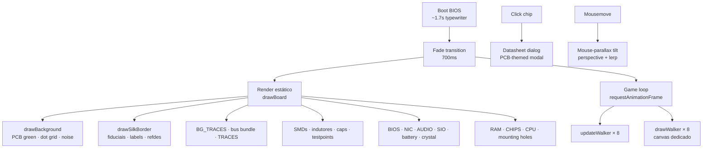

# MUNUX MAINBOARD · Portfolio v2.0

> Placa-mãe interativa em canvas — cada chip é um projeto, cada walker é uma stack, cada trilha é um barramento de dados.

**[▮ Ver ao vivo →](https://munique-feitoza.github.io/Portifolio/)**


---

## ▮ Sobre

Este portfólio é uma **placa-mãe** renderizada em canvas 2D. Sem listinha de cards arredondados — em vez disso:

- O **CPU central** sou eu.
- Cada **chip** é um projeto open-source meu, com pinos, silkscreen e datasheet clicável.
- **Bonequinhos pixel-art** caminham pelos barramentos carregando caixas — cada walker representa uma stack diferente (Tux pro Linux, Ferris pro Rust, foguete pra Stellar/NASA, ônibus pro system-bus, etc.).
- **Periféricos secundários** (BIOS, NIC, áudio, super I/O, VRM, bateria CMOS, cristal oscilador, mounting holes) preenchem a placa como uma de verdade.
- **J1·DEBUG** no topo é o header de contato — pinos pra GitHub, LinkedIn e email.

A escolha estética é proposital: meu foco profissional é **low-level** (Rust, C, Kotlin/JVM, Linux), e a interface tinha que refletir isso. Nenhum framework gigante, nenhum design system pronto — só canvas 2D + DOM + matemática de path-following.

---

## ▮ Stack

| Camada    | Tech |
|-----------|------|
| Render    | Canvas 2D API · sprites pixel-art procedurais via string-bitmap |
| Animação  | `requestAnimationFrame` + sistema próprio de path-following |
| UI        | DOM overlay sobre canvas · `<dialog>` nativo pra modal |
| Tilt      | Mouse-parallax com `perspective()` + lerp |
| Fonts     | JetBrains Mono + VT323 (Google Fonts) |
| Build     | Nenhum — HTML/CSS/JS servido estático |

**Zero dependências JavaScript.** Sem Bootstrap, sem framework, sem CDN além das fontes.

---

## ▮ Arquitetura



---

## ▮ Projetos na placa

| Chip | Stack | Resumo |
|------|-------|--------|
| [MUNUX](https://github.com/Munique-Feitoza/Munux) | C · Linux Kernel · Bash | Distro Linux didática (do básico ao avançado) |
| [Munux-Reactive-Workspace](https://github.com/Munique-Feitoza/Munux-Reactive-Workspace) | Rust | Compositor reativo experimental |
| [Obscura](https://github.com/Munique-Feitoza/Obscura) | Rust | Stealth & anti-fingerprint toolkit |
| [server-controller](https://github.com/Munique-Feitoza/server-controller) | Kotlin · Coroutines · SSH | Orquestrador remoto de servidores |
| [slack-tracker](https://github.com/Munique-Feitoza/slack-tracker) | Rust · Slack API · WebSockets | Observer de atividade Slack |
| [Stellar-Narrators](https://github.com/pancakehoneyb/Stellar-Narrators) | HTML · CSS · JS · NASA APIs | Team de 5 mulheres — NASA Space Apps Challenge |
| Munux-Books | Markdown · mdBook | Documentação Munux (local, em breve no GH) |

---

## ▮ Walkers e seus barramentos

Cada chip tem um bonequinho dedicado caminhando pela sua trilha, carregando caixas entre o CPU e o periférico. Velocidades e visuais variam por stack:

| Walker | Trilha | Velocidade | Significado |
|--------|--------|-----------|-------------|
| **Tux** (pinguim) | CPU ↔ MUNUX | 55 px/s | syscalls Linux |
| **Ferris** (caranguejo) | CPU ↔ REACTIVE-WS | 70 px/s | crates Rust |
| **Hooded** (encapuzado) | CPU ↔ OBSCURA | 35 px/s | pacotes ocultos |
| **Book** (livro com pernas) | CPU ↔ MUNUX-BOOKS | 40 px/s | páginas Markdown |
| **Rocket** (foguete) | CPU ↔ STELLAR | 90 px/s | dados estelares |
| **Droid** (robozinho) | CPU ↔ SERVER-CTRL | 50 px/s | containers Kotlin |
| **Postman** (carteiro) | CPU ↔ SLACK-TRACKER | 60 px/s | eventos Slack |
| **Bus** (ônibus amarelo) | CPU ↔ RAM (8 lanes) | 100 px/s | tokens LLM (Ollama) |

Os walkers entram em cena com **staggers desfasados** (0–2400ms) pra não andarem em uníssono.

---

## ▮ Rodando localmente

```bash
git clone https://github.com/Munique-Feitoza/Portifolio.git
cd Portifolio
python3 -m http.server 8765
# abre http://localhost:8765/
```

Não precisa Node, npm, nem build step. É HTML estático.

---

## ▮ Estrutura

```
.
├── index.html              # boot overlay · canvas pcb · canvas walkers · chips overlay · datasheet
├── src/
│   ├── scripts/main.js     # toda a lógica (canvas render + game loop + UI)
│   └── styles/styles.css   # paleta PCB · boot CRT · scanlines · datasheet · tilt
└── README.md
```

Tudo cabe em ~75KB total (HTML 2.7KB · CSS 20KB · JS 54KB).

---

## ▮ Contato

| Canal     | Link |
|-----------|------|
| GitHub    | [github.com/Munique-Feitoza](https://github.com/Munique-Feitoza) |
| LinkedIn  | [in/munique-feitoza-77034b231](https://www.linkedin.com/in/munique-feitoza-77034b231/) |
| Email     | [muniquefeitoz4@gmail.com](mailto:muniquefeitoz4@gmail.com) |

---

## ▮ Sobre mim

Junior Developer formando em **Análise e Desenvolvimento de Sistemas (ADS)** em maio/2026. Foco em low-level: distros Linux, sistemas em Rust e C, automação Kotlin/JVM. Construo do zero quando o que existe não serve.

---

`MUNUX MAINBOARD v2.0 · ASSEMBLED IN BR · 2026`
